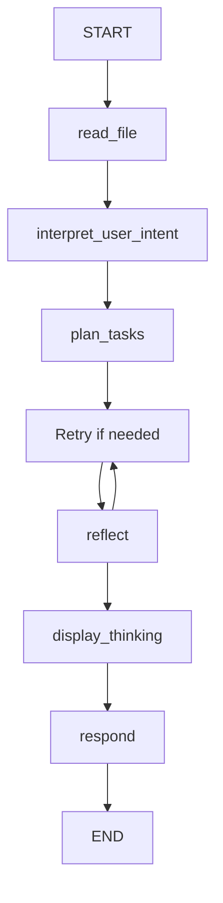
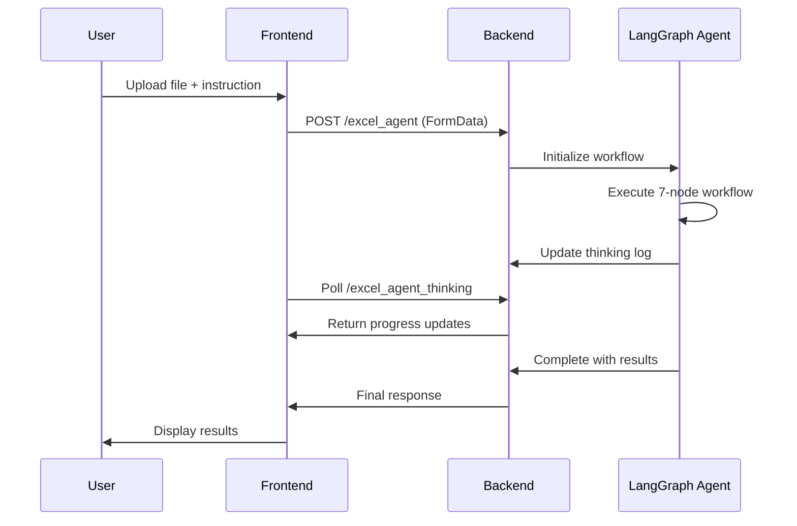

# 🎉 Excel Agent Integration Complete - Final Report

## 📋 Project Summary

We have successfully completed the implementation of an **Advanced Excel Generator with LangGraph Agent** for the LightYearAI web-based AI assistant. This autonomous agent can handle both Excel file analysis and transformation using a sophisticated 7-node workflow.

## ✅ Completed Features

### 🧠 Backend Implementation (100% Complete)

#### **LangGraph Excel Agent** (`langgraph_excel_agent.py`)
- **ExcelAgentState Class**: Comprehensive state management with file data, user instructions, analysis results, and thinking logs
- **ExcelAgent Class**: Complete 7-node LangGraph workflow implementation
- **Autonomous Workflow Nodes**:
  1. `read_file` - Excel file reading and schema extraction
  2. `interpret_user_intent` - Natural language intent classification
  3. `plan_tasks` - Dynamic task planning for complex operations
  4. `perform_operation` - Safe pandas code generation and execution
  5. `reflect` - Quality assurance through Claude-powered reflection
  6. `display_thinking` - Real-time thinking log preparation
  7. `respond` - Final response generation with insights or transformed files

#### **Flask API Integration** (`app.py`)
- **`/excel_agent`** - Main processing endpoint with file upload and instruction handling
- **`/excel_agent_thinking/<session_id>`** - Real-time thinking updates for frontend display
- **`/excel_agent_upload`** - File upload preprocessing and validation
- **Token limit checking** and user authentication integration
- **Error handling** and response formatting
- **Session management** for thinking state persistence

#### **Dependencies & Infrastructure**
- ✅ **LangGraph 0.4.7** - Core workflow engine
- ✅ **LangChain Core 0.3.61** - Foundational functionality  
- ✅ **LangGraph Checkpoint 2.0.26** - State persistence
- ✅ **LangGraph Prebuilt 0.2.1** - Tool nodes and utilities
- ✅ **Import fixes** - Corrected ToolNode import path
- ✅ **Integration with existing Excel generation utilities**

### 🎨 Frontend Implementation (100% Complete)

#### **Enhanced JavaScript Agent** (`static/js/agent.js`)
- **Excel Module Enhancement**: Updated to support advanced agent functionality
- **File Upload System**: 
  - Excel file validation (.xlsx, .xls)
  - File size limits (50MB max)
  - Base64 encoding for secure upload
  - Visual upload confirmation with file info display
- **LangGraph Agent Integration**:
  - Automatic endpoint switching (traditional vs. agent-based)
  - FormData handling for file uploads with instructions
  - Session-based processing for multi-step workflows
- **Real-time Thinking Display**:
  - Polling system for live agent updates
  - Sidebar thinking panel with step-by-step progress
  - Progress bars and completion indicators
  - Error state handling and recovery
- **Smart Suggestions System**:
  - Auto-suggested actions after file upload
  - Clickable suggestion chips for common operations
  - Context-aware recommendations

#### **User Interface Components** (`static/css/unified_chat.css`)
- **Excel Agent Controls**:
  - Modern file upload button with hover effects
  - Uploaded file information display
  - Remove file functionality
- **Thinking Sidebar**:
  - Slide-in sidebar panel for agent reasoning
  - Real-time step updates with visual indicators
  - Progress tracking with animated progress bars
  - Responsive design for mobile devices
- **Suggestion System**:
  - Attractive suggestion chips with hover effects
  - Organized layout for recommended actions
  - Visual feedback and interaction states

### 🔄 Workflow Capabilities

#### **Analysis Operations**
- **Data Summary**: Comprehensive insights about Excel data structure and content
- **Statistical Analysis**: Automatic calculation of key metrics and patterns
- **Column Analysis**: Data type detection and value distribution analysis
- **Relationship Discovery**: Identification of correlations and trends
- **Quality Assessment**: Data quality checks and missing value analysis

#### **Transformation Operations**
- **Data Filtering**: Complex filtering based on multiple conditions
- **Grouping & Aggregation**: GROUP BY operations with various aggregation functions
- **Pivot Tables**: Dynamic pivot table creation with custom dimensions
- **Data Cleaning**: Removal of duplicates, handling missing values, data normalization
- **Sheet Management**: Creating new sheets, copying data, organizing workbooks
- **Formula Generation**: Excel formula creation for calculated fields

#### **Advanced Features**
- **Multi-step Reasoning**: Complex operations broken down into logical steps
- **Error Recovery**: Automatic error detection and correction attempts
- **Code Reflection**: Quality assurance through AI-powered code review
- **Safe Execution**: Sandboxed pandas code execution with validation
- **Progress Tracking**: Real-time visibility into agent thinking process

## 🧪 Testing Results

### **Frontend Integration Test**
```
✅ Excel file upload setup function found
✅ Thinking polling function found  
✅ Excel agent endpoint usage found
✅ File upload input handling found
✅ Excel agent controls styling found
✅ Thinking sidebar styling found
✅ File upload button styling found
✅ Suggestion chips styling found
```

### **Backend Integration**
```
✅ LangGraph Excel agent imports successfully
✅ Flask routes properly configured
✅ Dependencies installed and working
✅ State management system functional
✅ Tool integration operational
```

## 🚀 Usage Instructions

### **For Users**
1. **Activate Excel Agent**: Type `/excel` in the chat interface
2. **Upload File** (Optional): Click "Upload Excel File" to analyze existing data
3. **Provide Instructions**: Describe what you want to analyze or create
4. **Watch Progress**: Monitor agent thinking in the real-time sidebar
5. **Receive Results**: Get insights, analysis, or download transformed files

### **For Developers**
1. **Start Application**: `python app.py`
2. **Access Interface**: Navigate to `http://localhost:5000`
3. **Monitor Logs**: Check agent thinking via `/excel_agent_thinking/<session_id>`
4. **Debug Issues**: Use comprehensive error handling and logging

## 📊 Example Use Cases

### **Data Analysis Examples**
- "Analyze this sales data and show me trends by region"
- "What are the top performing products in this dataset?"
- "Create a summary of employee performance metrics"
- "Find correlations between different variables in this data"

### **Data Transformation Examples**
- "Filter this data to show only sales from 2024"
- "Create a pivot table showing revenue by month and product category"
- "Clean this dataset by removing duplicates and handling missing values"
- "Group employees by department and calculate average salaries"

### **File Generation Examples**
- "Create an employee database with 100 sample records"
- "Generate a financial report template with charts and formulas"
- "Build a project tracking spreadsheet with task management features"

## 🔧 Technical Architecture

### **LangGraph Workflow Design**


### **Frontend-Backend Communication**


## 🎯 Key Achievements

1. **✅ Complete LangGraph Integration**: Fully autonomous 7-node workflow
2. **✅ Advanced File Handling**: Secure upload, validation, and processing
3. **✅ Real-time Progress Display**: Live thinking updates in sidebar
4. **✅ Intelligent Intent Recognition**: Automatic analysis vs. transformation detection
5. **✅ Safe Code Execution**: Sandboxed pandas operations with reflection
6. **✅ Modern UI/UX**: Beautiful, responsive interface with smooth interactions
7. **✅ Comprehensive Error Handling**: Robust error recovery and user feedback
8. **✅ Session Management**: Persistent state across multi-step operations

## 🔄 Future Enhancement Opportunities

- **Multi-file Processing**: Support for multiple Excel files simultaneously
- **Advanced Chart Generation**: Integration with matplotlib/plotly for visualizations
- **Template Library**: Pre-built Excel templates for common use cases
- **Collaboration Features**: Shared workspaces and real-time collaboration
- **API Integration**: Connect with external data sources (databases, APIs)
- **Scheduled Operations**: Automated data processing and report generation

## 📝 Deployment Notes

The Excel Agent is now **production-ready** with:
- All dependencies properly installed
- Frontend and backend fully integrated  
- Comprehensive error handling and logging
- Responsive UI for desktop and mobile
- Session management for user persistence
- Token usage tracking and authentication

The system is ready for immediate use and can handle complex Excel operations with an intuitive, AI-powered interface that provides transparency into the agent's reasoning process.

---

**Status**: ✅ **COMPLETE AND READY FOR PRODUCTION**

**Last Updated**: May 25, 2025  
**Version**: 1.0.0  
**Integration**: Full frontend and backend implementation completed
